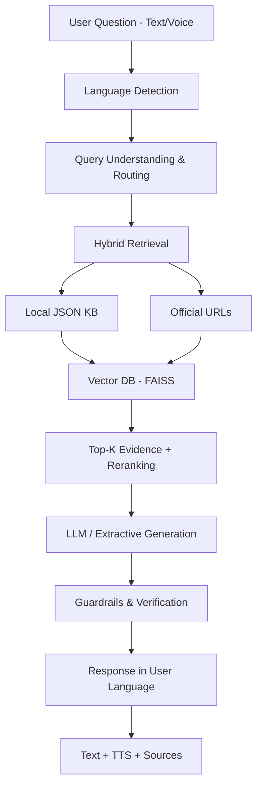
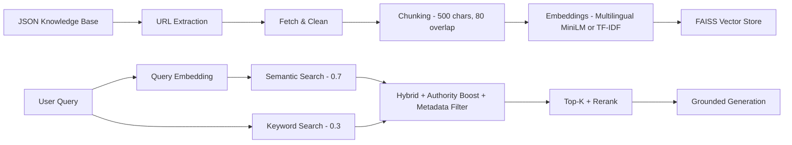
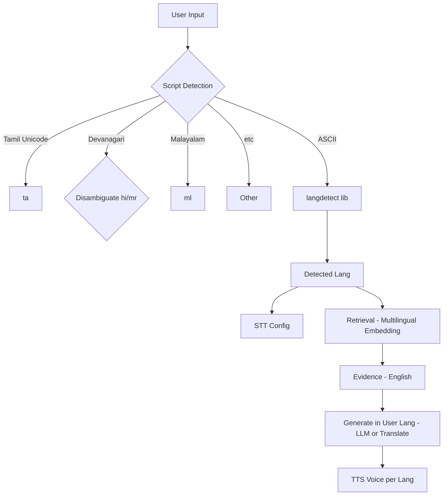
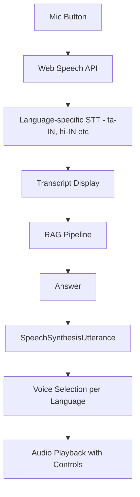

# Sahayak AI (சஹாயக் AI) - Multilingual Cooperative Governance & Legal Assistance Chatbot

**SIH Problem Statement 26088**

> A trusted multilingual cooperative assistant that you can talk to.

Production-ready prototype for Smart India Hackathon - A chatbot-first AI platform for cooperative members, farmers, PACS members, rural users, and officials to get reliable, source-grounded answers via text or voice.

---

## 🌟 Features

### Core
- **Chatbot-First UX** - Clean, rural-friendly interface with large fonts, high contrast
- **RAG Pipeline** - Retrieval-Augmented Generation with JSON knowledge base + official URLs
- **Source Citations** - Every answer shows official sources used
- **Hallucination Protection** - Guardrails, evidence threshold, fake-section detection
- **No Hardcoded Answers** - All answers dynamically generated from retrieved evidence

### Multilingual (8 Languages)
- English, Tamil (தமிழ்), Hindi (हिन्दी), Malayalam (മലയാളം), Telugu (తెలుగు), Kannada (ಕನ್ನಡ), Marathi (मराठी), Bengali (বাংলা)
- Auto language detection (Unicode script + langdetect)
- Manual language selector
- Answer in user's language
- TTS voice per language

### Voice
- **Speech-to-Text** - Web Speech API with 8 language support, listening overlay
- **Text-to-Speech** - SpeechSynthesis with language-specific voice selection
- Listen button per answer, Pause/Resume/Stop

### Knowledge Domains
- Cooperative Laws (MSCS Act, State Acts, Model Bye-laws, 97th Amendment)
- Government Schemes (NCP 2025, PACS computerization, Grain Storage, CSC, etc.)
- PACS Services (membership, loans, deposits, KCC, etc.)
- Crop Insurance (PMFBY, WBCIS, claim process)
- Financial Literacy (RBI/NABARD programs)
- Grievance Redressal (CPGRAMS, pgportal)

---

## 🏗️ Architecture

### Overall Flow


### RAG Pipeline


### Multilingual Architecture


### Voice Architecture


---

## 📁 Project Structure

```
sahayak-ai/
├── backend/
│   ├── main.py                 # FastAPI app
│   ├── rag/
│   │   ├── ingestion.py        # JSON + URL ingestion, chunking, embeddings
│   │   ├── retrieval.py        # Hybrid retrieval, authority boost
│   │   ├── embeddings.py       # Transformer + TF-IDF fallback
│   │   ├── reranking.py        # Simple reranking
│   │   └── url_loader.py       # Safe URL fetching, HTML/PDF extraction
│   ├── chatbot/
│   │   ├── generator.py        # LLM + extractive generation
│   │   ├── guardrails.py       # Hallucination protection
│   │   └── language.py         # 8-language config, detection, routing
│   └── data/                   # Vector store, metadata (generated)
├── frontend/
│   └── index.html              # Single-file chatbot UI (production ready)
├── knowledge/
│   └── knowledge_base.json     # Primary knowledge source
├── scripts/
│   └── ingest.py               # CLI ingestion
├── .env.example
├── requirements.txt
├── README.md
└── .gitignore
```

---

## 🚀 Installation

### Prerequisites
- Python 3.9+
- Node not required (frontend is vanilla HTML/JS)
- Modern browser with Web Speech API support (Chrome recommended)

### Backend Setup

```bash
# Clone / copy project
cd sahayak-ai

# Create venv (recommended)
python -m venv .venv
source .venv/bin/activate  # Linux/Mac
# .venv\Scripts\activate   # Windows

# Install dependencies
pip install -r requirements.txt

# For minimal install (without heavy transformers, uses TF-IDF):
pip install fastapi uvicorn python-multipart pydantic requests beautifulsoup4 lxml faiss-cpu numpy scikit-learn langdetect python-dotenv trafilatura PyPDF2 deep-translator

# Copy env
cp .env.example .env
# Edit .env if you have OpenAI/Groq key (optional)

# Ingest knowledge base
python scripts/ingest.py

# Optional: with URL fetching (requires internet, takes longer)
python scripts/ingest.py --fetch-urls --max-urls 10
```

### Environment Variables (.env)

```bash
OPENAI_API_KEY=sk-...          # Optional - if present, uses LLM for better answers
GROQ_API_KEY=gsk_...           # Alternative LLM (free tier)
EMBEDDING_MODEL=sentence-transformers/paraphrase-multilingual-MiniLM-L12-v2
TOP_K=6
EVIDENCE_THRESHOLD=0.15
PORT=8000
```

> **Note:** System works WITHOUT any API key using extractive RAG + TF-IDF. LLM only enhances fluency.

### Running

```bash
# Backend
uvicorn backend.main:app --host 0.0.0.0 --port 8000 --reload

# Frontend
# Option 1: Open frontend/index.html directly (will need CORS or backend serving)
# Option 2: Backend serves frontend at /app if frontend folder exists
# Visit http://localhost:8000/app

# Option 3: Simple http server for frontend (separate)
cd frontend
python -m http.server 3000
# Then open http://localhost:3000

# Best: Use backend's static mount - just open http://localhost:8000/app after starting backend
```

---

## 🧠 Knowledge Base Format

The JSON at `knowledge/knowledge_base.json` is dynamically loaded. Structure:

```json
{
  "metadata": { "version": "0.4.0", ... },
  "cooperative_laws": [
    {
      "id": "law-001",
      "title": "MSCS Act, 2002",
      "summary": "...",
      "key_points": ["..."],
      "source_name": "Ministry of Cooperation",
      "source_url": "https://cooperation.gov.in",
      "last_verified": "2026-09"
    }
  ],
  "government_schemes": [...],
  "pacs_services": [...],
  "crop_insurance": [...],
  "financial_literacy": [...],
  "grievance_redressal": [...],
  "state_cooperative_registrars": {
    "entries": { "Tamil Nadu": {...}, ... }
  }
}
```

Ingestion flattens all entries, chunks them, embeds, and stores with metadata:
- chunk, title, category, query_type, source_name, source_url, authority, retrieved_at, content_hash

To update knowledge: replace JSON and re-run `python scripts/ingest.py`

---

## 🔍 RAG Details

### Ingestion
1. Load JSON, validate structure flexibly
2. Flatten into documents (title + summary + key_points + etc.)
3. Chunk (500 chars, 80 overlap, paragraph-aware)
4. Optional: Fetch official URLs (allowlist check, trafilatura/BS4 extraction, PDF support)
5. Embeddings: Try `sentence-transformers/paraphrase-multilingual-MiniLM-L12-v2`, fallback to TF-IDF
6. Store in FAISS (IndexFlatIP, normalized for cosine) + metadata.json

### Retrieval (Hybrid)
```
Semantic Search (0.7) - FAISS cosine
+ Keyword Search (0.3) - TF-IDF or BM25-like overlap
+ Authority Boost - gov.in, pib.gov.in +0.25, NABARD +0.15, recent +0.05
+ Metadata Filter - query_type matching (LAW, SCHEME, PACS, etc.) +0.2
+ Reranking - phrase match, legal section number boost
= Final Score
Threshold 0.15, Top-K 6
```

### Query Routing
Classify into: LAW, SCHEME, PACS, CROP_INSURANCE, FINANCIAL_LITERACY, GRIEVANCE, GENERAL_COOPERATIVE, UNKNOWN
Uses keyword matching for fast routing.

### Generation
- **If LLM key present**: Prompt with evidence, strict grounding instructions, answer in user language
- **Else**: Extractive - take best chunks, structure, optionally translate via deep-translator
- Guardrails check for fabricated sections, URLs, schemes, grounding score
- Evidence levels: high (>0.6, 3+ docs), medium (>0.3, 2+), low (>0.15, 1), none

---

## 🌐 Multilingual

Language config object in `backend/chatbot/language.py` and frontend `index.html`:

```json
{
  "ta": {
    "name": "Tamil",
    "nativeName": "தமிழ்",
    "stt_code": "ta-IN",
    "tts_code": "ta-IN",
    "fallback_message": "..."
  }
}
```

Detection:
1. Unicode script ranges (Tamil 0B80-0BFF, Malayalam 0D00-0D7F, etc.)
2. langdetect library
3. Keyword markers
4. Fallback to selected language

STT: Web Speech API with `recognition.lang = ta-IN` etc.
TTS: SpeechSynthesisUtterance with voice selection per language.

---

## 🎤 Voice

- **Input**: Click 🎤, Web Speech API, interim results shown, overlay with wave animation, permission handling, silence detection
- **Output**: 🔊 Listen button per message, finds best voice for language (e.g., `voice.lang startsWith 'ta'`), rate 0.9, pause/resume/stop

Handles: permission denied, no speech, background noise, network failure, unsupported browser.

---

## 🛡️ Guardrails & Hallucination Protection

- **Fake tests**: "Section 999", "XYZ Cooperative Scheme 2026" -> must return fallback, not hallucinate
- **Section check**: Extract section numbers from answer, verify in evidence
- **URL check**: URLs in answer must exist in evidence
- **Grounding score**: Keyword overlap between answer and evidence
- **Evidence threshold**: Low evidence -> cautious answer or fallback
- **No fake data**: Never invent schemes, eligibility, contact info, URLs

Fallback message per language when evidence insufficient.

---

## ✅ Testing

### Manual Tests (from spec)

**English**: What documents are required to become a PACS member?
**Tamil**: ஒரு PACS-ல் உறுப்பினராக சேர என்ன ஆவணங்கள் தேவை?
**Hindi**: PACS का सदस्य बनने के लिए कौन से दस्तावेज़ आवश्यक हैं?
**Malayalam**: ഒരു സഹകരണ സംഘത്തിൽ അംഗമാകാൻ ആവശ്യമായ രേഖകൾ ഏതൊക്കെയാണ്?
**Telugu**: PACS సభ్యుడిగా చేరడానికి ఏ పత్రాలు అవసరం?
**Kannada**: PACS ಸದಸ್ಯರಾಗಲು ಯಾವ ದಾಖಲೆಗಳು ಅಗತ್ಯವಿದೆ?
**Marathi**: PACS चे सदस्य होण्यासाठी कोणती कागदपत्रे आवश्यक आहेत?
**Bengali**: PACS-এর সদস্য হতে কী কী নথি প্রয়োজন?

**Hallucination tests**:
- What is Section 999 of Tamil Nadu Cooperative Societies Act? -> Should say not found
- What is XYZ Cooperative Scheme introduced in 2026? -> Should say not found

**Edge**: empty question, very long, follow-up ("Who is eligible?" after PMFBY), voice failure, URL unavailable.

### API Test

```bash
curl -X POST http://localhost:8000/api/chat \
  -H "Content-Type: application/json" \
  -d '{"question": "What is PMFBY?", "language": "en"}'

curl -X POST http://localhost:8000/api/chat \
  -H "Content-Type: application/json" \
  -d '{"question": "ஒரு PACS-ல் உறுப்பினராக சேர என்ன ஆவணங்கள் தேவை?", "language": "ta"}'
```

---

## 📊 Source Priority

1. Official Government / Ministry / Department (cooperation.gov.in, gov.in, nic.in)
2. Statutory documents - Acts, Rules, Bye-laws, notifications
3. Official cooperative institutions (NABARD, NCDC, NCCT)
4. Trusted institutional sources
5. Other only when explicitly allowed

If conflict: prefer most authoritative, most recent, inform user, never silently combine.

---

## ⚠️ Limitations & Disclaimer

- This is an **information and assistance system, not a lawyer**. Legal answers are based on retrieved sources, not legal advice.
- Knowledge base is static (Sept 2026) + optional URL fetching. Real-time scheme dates, state-specific rules may change - always verify with official portal.
- TF-IDF fallback works offline but less accurate than transformer embeddings for multilingual semantic search.
- Translation via deep-translator/Google is best-effort; official scheme names preserved in English.
- Voice depends on browser support and OS voices. Tamil, Malayalam, etc. TTS quality varies by device.
- No real-time CPGRAMS filing - provides procedure and portal links.

---

## 🚀 Deployment

### Local
```bash
uvicorn backend.main:app --host 0.0.0.0 --port 8000
# Open http://localhost:8000/app
```

### Docker (example)
```dockerfile
FROM python:3.10-slim
WORKDIR /app
COPY requirements.txt .
RUN pip install -r requirements.txt
COPY . .
RUN python scripts/ingest.py
CMD ["uvicorn", "backend.main:app", "--host", "0.0.0.0", "--port", "8000"]
```

### Environment
- Set `OPENAI_API_KEY` in production for best quality
- Use persistent volume for `backend/data/`
- Enable HTTPS for microphone (Web Speech API requires secure context)
- CORS configured for all origins in prototype - restrict in production

---

## 🔮 Future Enhancements

- [ ] Full-text of State Cooperative Societies Acts ingestion
- [ ] Live integration with data.gov.in / myScheme API for real-time eligibility
- [ ] OCR for scanned government PDFs
- [ ] Cross-encoder reranking
- [ ] User feedback loop for answer quality
- [ ] PWA for offline rural use
- [ ] WhatsApp / IVR integration for low-literacy users
- [ ] Admin dashboard for KB health (currently /api/status)
- [ ] Fine-tuned small LLM for cooperative domain
- [ ] Document upload for cooperative bye-laws

---

## 👥 Team & SIH

**Problem Statement**: SIH26088 - Multilingual Cooperative Governance & Legal Assistance Chatbot
**Category**: Smart Automation / AI
**Organization**: Ministry of Cooperation (proposed)

Built for Smart India Hackathon 2025-26 prototype.

---

## 📄 License

MIT - For educational / hackathon purposes. Official government content remains property of respective departments.

---

## 🙏 Acknowledgments

- Ministry of Cooperation, Government of India
- PIB, NABARD, PMFBY, CPGRAMS official portals
- Cooperative departments of Tamil Nadu and other states
- Open source: FastAPI, FAISS, sentence-transformers, trafilatura

---

**Made with 🌾 for Indian farmers and cooperative members**
